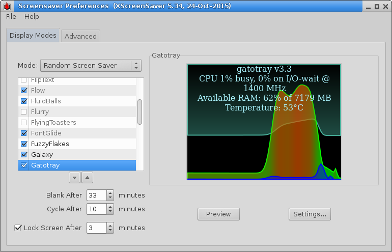

# gatotray #
`gatotray` is a tiny CPU monitor displaying several stats graphically
(usage, temperature, frequency) in small space, and tight on resources.
Since version 3.0, It can also run as a screensaver.



## License ##

(c) 2011-2020 by gatopeich, licensed under a Creative Commons Attribution 3.0
Unported License: http://creativecommons.org/licenses/by/3.0/
Briefly: Use it however suits you better and just give me due credit.


## Dependencies
Requires GTK2 libraries and procps: `sudo apt install libgtk2.0-dev libprocps-dev`


## Features ##

* Very lightweight, colourful, user friendly, broadly compatible.

* Tracks top consuming processes across multiple resource categories:
  - CPU usage (current, average, and cumulative)
  - Memory consumption
  - I/O wait time
  - File descriptors (useful for modern IDEs and applications)
  - Thread count (important for multi-threaded applications)

* Designed to run continuously in small screen space to provide good idea of the
  CPU's status in a glimpse.

* Can run as a screensaver on modern desktop environments (MATE, XFCE4) as well 
  as legacy xscreensaver, so you can see your CPUs at work from a prudential 
  distance. Simply right-click the tray icon and select "Install screensaver".

* Works in almost any Linux desktop, as long as it is Freedesktop compatible:
  XFCE, GNOME, GTK+, KDE, and more.

* Logarithmic time scale tells a long story in very small space.

* Thermometer graph, blinks when temperature reaches a configurable threshold.

* Tooltip shows a textual summary of system status.

* On click, it opens a customizable `top` window for detailed system usage.

* Easy customization of colors and options, including transparency.

* History persistence: gatotray automatically saves CPU, memory, and temperature history every minute to `/tmp/gatotray-history.bin`, ensuring that meaningful data is displayed immediately when the application restarts during the same session (especially useful for the screensaver mode).


## Configuration ##

gatotray provides an easy-to-use preferences dialog accessible by right-clicking the tray icon and selecting "Preferences".

### Screensaver Installation

To use gatotray as your screensaver:

1. Right-click the gatotray icon in your system tray
2. Click "Install screensaver"
3. Authenticate when prompted (pkexec or sudo)
4. The screensaver preferences dialog will open automatically
5. Select "Gatotray CPU Monitor" from the list of screensavers

**Supported Desktop Environments:**
- **MATE** (Linux Mint MATE, Ubuntu MATE, etc.) - Uses mate-screensaver
- **XFCE4** (Xubuntu, Linux Mint XFCE, etc.) - Uses xfce4-screensaver
- **Others** - Falls back to legacy xscreensaver if installed

The screensaver shows a beautiful full-screen visualization of your CPU usage, 
temperature, and memory consumption with historical graphs.

### Temperature Display

The "Temperature:" dropdown in the preferences dialog allows you to control temperature monitoring:

- **None** - Disables the temperature thermometer
- **Auto (first available)** - Automatically selects the first available temperature sensor (default)
- **Specific sensors** - Choose from a list of detected temperature sensors (e.g., "coretemp (hwmon0 temp1)" for CPU temperature)

To configure temperature monitoring:

1. Right-click the gatotray icon in your system tray
2. Click "Preferences"
3. In the preferences dialog, find the "Temperature:" dropdown
4. Select your preference:
   - "None" to hide the thermometer
   - "Auto (first available)" for automatic detection (default)
   - A specific sensor from the list to monitor that sensor

The dropdown shows all available temperature sensors with descriptive labels when possible. gatotray searches for temperature sensors in the following locations:
- `/sys/class/hwmon/hwmonN/temp*_input` (hardware monitoring sensors)
- `/sys/class/thermal/thermal_zoneN/temp` (thermal zones)
- `/proc/acpi/thermal_zone/*/temperature` (ACPI thermal zones)

Your selection is saved in `~/.config/gatotrayrc` and will be remembered across sessions.


## Performance & Resource Consumption ##

_(Outdated info but the same principle still applies)_

gatotray aims to be a reliable and lightweight application, suitable for usage
in the most resource constrained systems. Here are some measures comparing
different versions running on:
   - A Core 2 Duo U9400 @ 800 MHz (max=1.4GHz) reporting 2793 bogomips.
   - GTK+ version 2.20.1(-0ubuntu2) (indirect dependencies vary with distro)

After 7 hours this is a pretty version of what we get with the command
"ps -o bsdtime,rss,etime,pid,command -C gatotray|sort -n".
```
CPU%  CPUtime    RSS  ElapsedTime  Version and options:
0.17     0:45   6984     07:11:57  gatotray v2.0 64 bits opaque 21x21
0.19     0:48   7464     07:11:14  gatotray v2.0 64 bits transparent 21x21
0.19     0:49   6176     07:10:13  gatotray v2.0 32 bits opaque 21x21
0.21     0:54   6560     07:09:48  gatotray v2.0 32 bits transparent 21x21
```
So gatotray v2.0 eats roughly less than 6 bogomips in its several configurations
, transparency costing ~10% additional CPU, and running the 32 bit version
saving a bit under 1MB RSS memory.


### watchRSS ###
Here is the "watchRSS" script used to produce the data above:

```
#!sh

#!/bin/bash
$@ &
pid=$!
while watch="`ps -o bsdtime $pid` `grep RSS /proc/$pid/status`"; do
	[ "$watch" != "$old" ] && echo `ps -o etime $pid` CPU$watch
	old="$watch"
	sleep .1
done
```
